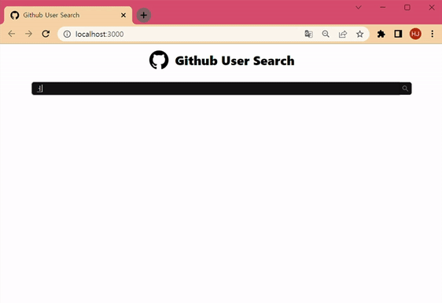

# **Github User Search**

> `Github API`를 사용한 User 검색

 

 

 

## 컴포넌트 구성

 - Header
 - SearchBar
   - UserProfile

 

 

### **Header**

 - Github로고와 text를 표기
 - 반응형 컴포넌트로 화면의 크기가 1080px 이하면 text의 font 크기가 작아지고 840px 이하면 text가 보여지지 않음

 

 

### **SearchBar**

 - User Id를 입력하면 `axios`로 해당 Id의 데이터를 요청하고 데이터를 저장
 - 저장한 데이터를 UserProfile 컴포넌트로 전달
 - 데이터가 없으면 UserProfile은 화면에 보여주지 않음

 

 

### **UserProfile**

 - props로 전달받은 데이터 중 6개의 API를 사용하여 화면에 나타냄
    - **avatar_url** : 프로필 이미지
    - **name** : 닉네임
    - **html_url** : Github 주소 (닉네임 클릭 시 이동)
    - **followers** : 팔로워 수
    - **followering** : 팔로잉 수
    - **public_repos** : 레포지토리 수