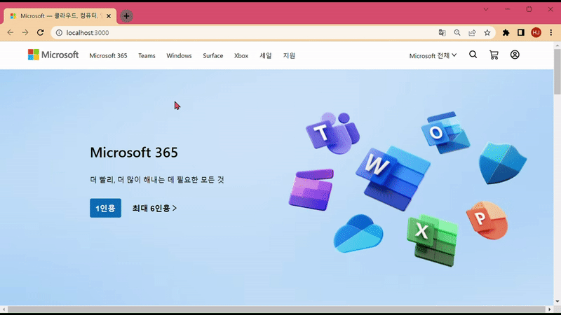
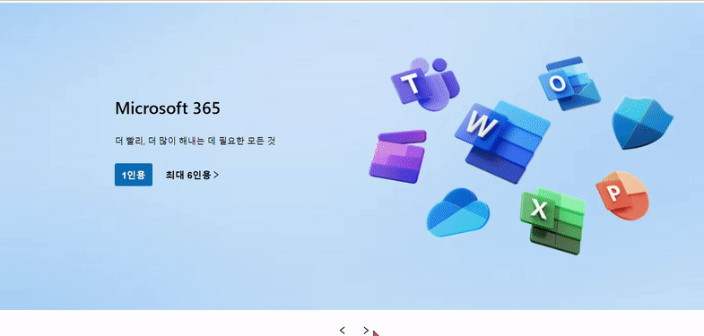
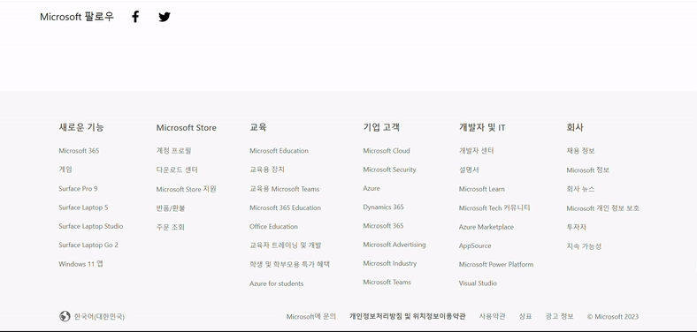

# **마이크로소프트 메인페이지 클론코딩**

> [Microsoft](https://www.microsoft.com/ko-kr/)
>

 

# 마이크로소프트 전체 화면

 

 

## **컴포넌트 구성**

 - NavBar
 - Carousel
 - ButtonIcon
 - Goods
 - Xbox
 - TopBtn
 - Footer

 

 

### **NavBar**

 

- **`onClick`** 을 사용하여 클릭 시 탭메뉴의 class가 active로 변환
- icon 메뉴를 hover하면 tooltip 메세지 나타남

 

 

### **Carousel**

 

- 첫 번째 슬라이드를 제외한 TOTAL_SLIDE의 개수를 지정하여 버튼 클릭 시 (TOTAL_SLIDE)00% 만큼 이동

 

#### 개선 사항
 - 슬라이드가 넘어갈 때 자연스럽게 이동
 - setInterval을 사용하여 자동 슬라이드 효과를 구현해볼 수 있음

 

 

### **ButtonIcon**, **Goods**, **Xbox**

 

- 각 데이터를 js 파일로 저장하여 `map()`으로 하나씩 꺼내어 생성
- Goods의 컴포넌트는 data와 isBusiness 두 개의 props를 받아 비즈니스용인지 아닌지 확인한 후 비즈니스용일 때만 text를 보여줌

 

 

### **TopBtn**

 

- `window.scrollY`의 위치를 설정하여 해당되는 구간에만 상단버튼을 표시
- `onClick` 시 top : 0 로 이동

 

 

### **Footer**

 

- `map()`을 사용하여 메뉴명과 하위 메뉴 생성