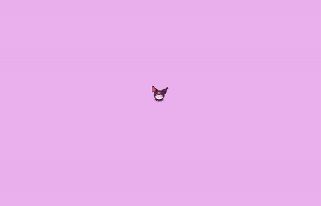

# Mouse Cursor

## **구현 화면**


<br>

## [**PointerMove**](https://developer.mozilla.org/en-US/docs/Web/API/Element/pointermove_event)

<br>

> pointer의 `좌표값이 변경`될 때 발생하는 이벤트
>

<br>
<hr>
<br>

## **Refactoring**

<br>

```javascript
// x좌표와 y좌표를 각각 변수 선언
const [X, setX] = useState(0);
const [Y, setY] = useState(0);

onPointerMove = {(e) => {
    setX = e.clientX;
    setY = e.clientY;
}};
```

#### 이전 코드

> x좌표와 y좌표를 각각 변수 선언을 해준 후, PointerMove 이벤트가 발생하면 마우스 커서의 x값, y값을 각각 setX, setY에 저장했다. 
>

<br>

```javascript
// x좌표와 y좌표를 하나의 객체로 만들어 변수를 선언
const [position, setPosition] = useState({x: 0, y: 0});

onPointerMove = {(e) => {
    setPosition({x: e.clientX, y: e.clientY})
}};
```

#### 리팩토링 코드

> x좌표와 y좌표는 동시에 업데이트되기 때문에 서로 연관있는 데이터이기에 하나의 객체로 관리하는 것이 효율적이다. 
>